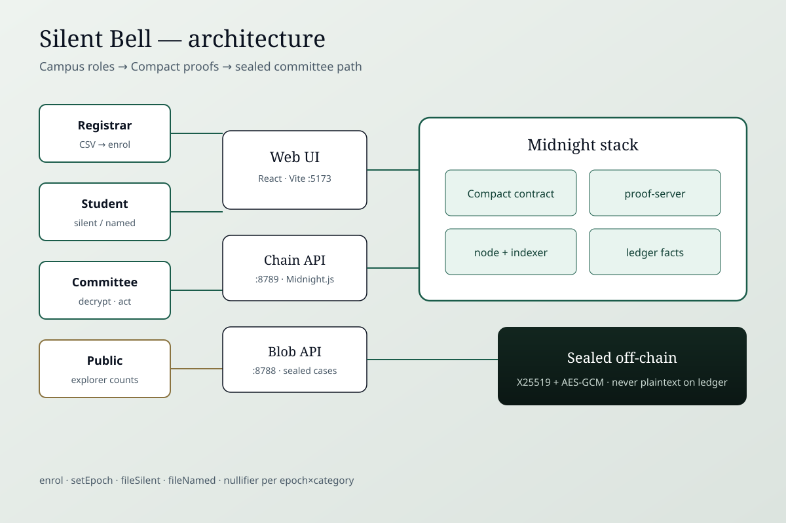
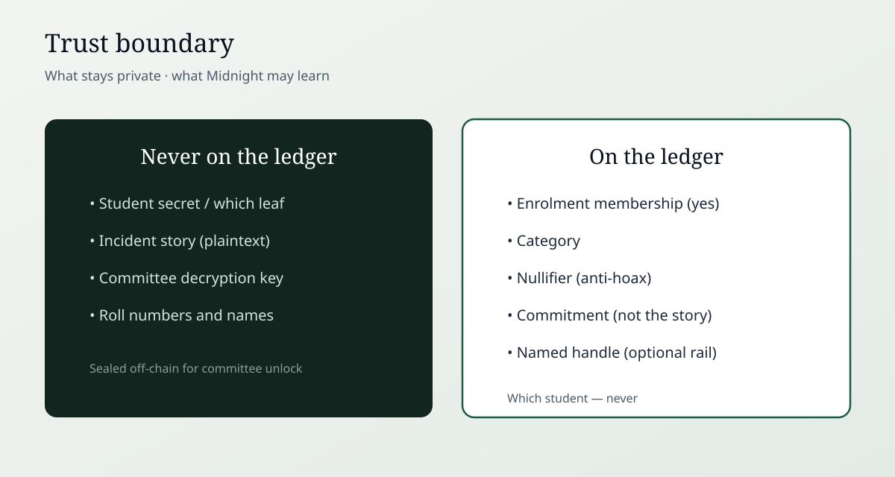

# Silent Bell

**The report that cannot be traced. The student who cannot be faked.**

Brainwave 2026 - Midnight Track. A **campus pilot product**: Compact proves the reporter is on this semester’s roll. The ledger never learns which student. A nullifier stops hoax floods. Incident plaintext is sealed off-chain for the committee only.

| Private (device / sealed store)               | Public (ledger)                             |
| --------------------------------------------- | ------------------------------------------- |
| Student secret, Merkle path, report plaintext | Membership, category, nullifier, commitment |
| Committee X25519 secret (passphrase-unlocked) | Named handle **only** on the Named rail     |

## Docs for judges

Start here: **[docs/JUDGE-BRIEF.md](docs/JUDGE-BRIEF.md)** — problem, product, why Midnight, proof flow, Preview contract, demo video. Score from that document.

| Doc | Purpose |
| --- | --- |
| [docs/JUDGE-BRIEF.md](docs/JUDGE-BRIEF.md) | Judge brief (answers + diagrams) |
| [OVERVIEW.md](OVERVIEW.md) | Short human story |
| [docs/ARCHITECTURE.md](docs/ARCHITECTURE.md) | Circuits and components |
| [COMPAT.md](COMPAT.md) | Versions + demo accounts |
| [docs/media/devpost-gallery/](docs/media/devpost-gallery/) | Role screenshots |
| [docs/media/SUBMISSION-EVIDENCE.html](docs/media/SUBMISSION-EVIDENCE.html) | Printable PDF of the brief |





## Sponsor stack

- **Compact** - `contracts/silent-bell.compact` (`enrol`, `setEpoch`, `fileSilent`, `fileNamed`)
- **Midnight.js 4.1.1** - deploy + callTx
- **proof-server 8.1.0** - proving
- **node + indexer** - local Docker / PreProd public endpoints
- **PreProd faucet / Preview faucet** - public-network funding for eligibility

## Quick start (local)

```bash
cd silent-bell
npm install && npm --prefix web install
npm run compile
docker compose up -d --wait
SKIP_COMPILE=1 npm run setup
npm run blob          # :8788
npm run chain         # :8789
npm run web           # :5173
```

Open **http://localhost:5173/** → **Live cast** or **Sign in** (accounts in `COMPAT.md`).

## Product flows

1. **Sign in** - role accounts (`COMPAT.md`).
2. **Registrar** - CSV roster → hashed leaves → epoch freeze.
3. **Student** - silent file / named emergency / My rings.
4. **Outsider** - silent file → FailWell (not on the roll).
5. **Duplicate** - same category → nullifier FailWell.
6. **Committee** - unlock → decrypt → Ack / Escalate / Close / Export.
7. **Explorer** - public counts only.
8. **Live demo** - one-click cast for judges.

## Public deploy (Midnight Preview - eligibility)

**Network:** Preview  
**Contract:** `5c5312147f35c25ff0ba3aa9771e46e6b19ea1522b232a08b3dacabc95fc4048`  
**Deployer:** `mn_addr_preview1guclk6ltr8prs87mu7um563r46fzdtvnazg0vzc8xame8qqhe93s7v7dx6`  
**Explorer:** https://explorer.preview.midnight.network/  
**Deployed:** 2026-08-26 (verified via Preview indexer `contractAction`)

```bash
npm run network preview
npx tsx src/deploy.ts --network preview
# Fund mn_addr_preview… at https://faucet.preview.midnight.network when prompted
```

## PreProd (optional twin)

Wallet sync against PreProd can hang / corrupt DUST checkpoints. Prefer Preview for eligibility.

```bash
npm run print-address
# Fund mn_addr_preprod… at https://faucet.preprod.midnight.network
npx tsx src/deploy.ts --network preprod
```

**PreProd unshielded (funded earlier):**  
`mn_addr_preprod136fxce5gstdxjm49vsse875qwt0u99rr8gytff7raqcf86q0936s7mncqy`

**PreProd contract:** not required — Preview address above meets track eligibility.

## Threat model (pilot)

| Threat         | Mitigation                                    |
| -------------- | --------------------------------------------- |
| Story on chain | Off-chain ciphertext; chain stores commitment |
| Who filed      | Merkle membership without leaf reveal         |
| Outsider       | Circuit fails without valid path              |
| Hoax flood     | Nullifier per epoch+category                  |
| Open inbox     | Committee passphrase + Bearer on GET          |
| Metadata       | Blob API binds localhost; no IP persistence   |

Not a UGC-certified production system. Synthetic hostel-lights narrative only.

## Layout

- `contracts/silent-bell.compact`
- `src/` - deploy, chain API, witnesses
- `web/` - product UI
- `services/blob-api.mjs` - sealed blobs + case status
- `fixtures/roster.csv` - sample issuer CSV
- `docs/` - Devpost, demo script, architecture, media

Pramaan is a **separate** repo: `../pramaan`.
