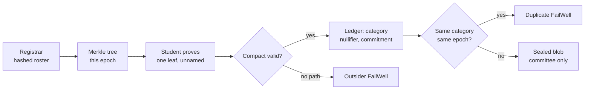

# Silent Bell — Judge brief

**Brainwave 2026 · Midnight Track**

> The report that cannot be traced. The student who cannot be faked.

A campus incident-intake product on Midnight. A student can prove they are on this semester’s roll, file a grievance, and keep their identity off the ledger. Outsiders cannot file. Duplicates cannot flood a category. The committee reads the case — not the silent name.

| | |
| --- | --- |
| **Demo video** | [youtu.be/KOa5WjgBbwM](https://youtu.be/KOa5WjgBbwM) |
| **Source** | [github.com/HawaleShailesh004/silentbell](https://github.com/HawaleShailesh004/silentbell) |
| **Preview contract** | `5c5312147f35c25ff0ba3aa9771e46e6b19ea1522b232a08b3dacabc95fc4048` |
| **Explorer** | [explorer.preview.midnight.network](https://explorer.preview.midnight.network/) |
| **Local setup** | [README.md](../README.md) · demo accounts in [COMPAT.md](../COMPAT.md) |
| **Printable PDF** | Open [media/SUBMISSION-EVIDENCE.html](media/SUBMISSION-EVIDENCE.html) → Ctrl+P |

---

## 1. The problem

Campuses need reports of ragging, harassment, and hostel abuse. Students are offered two doors. Both fail.

| Named complaint | Anonymous form |
| --- | --- |
| Identity is attached. Retaliation is the rational fear: seniors who know, a warden who “handles it quietly,” three years of being left out. Juniors stay silent. | Anyone can submit. Outsiders, rivalries, hoaxes. The committee receives noise and learns to trust nothing. Real harm disappears into the pile. |

**The actual question:** How do you prove a reporter is enrolled this semester — without revealing which student — and without letting fakes own the microphone?

The product narrative uses a **synthetic composite** (hostel lights / “intro”). Real harm is not submitted as content. The feeling is the requirement.

---

## 2. The product

Silent Bell is a full-stack campus pilot: registrar, student, outsider fail, duplicate fail, named emergency, committee inbox, public explorer. Not a circuit toy.

| Role | What they do | What Midnight learns |
| --- | --- | --- |
| **Registrar** | Publishes the semester roster as hashed Merkle leaves. Names stay in the CSV. | Roster root / membership set — not names |
| **Student (silent)** | Proves enrolment and files. Story is sealed to the committee key, stored off-chain. | Someone enrolled filed; category; nullifier; commitment. Never which leaf. |
| **Student (named)** | Same proof, plus a handle they choose to disclose — only when silence itself is unsafe. | Membership + the handle they published on purpose |
| **Outsider** | Tries to file. Circuit rejects. Product working. | No valid membership path |
| **Committee** | Unlocks the key on-device, decrypts, acknowledges, escalates, closes, or exports. | On the silent rail: still not which student |
| **Public explorer** | Sees epoch and counts. | Accountability without voyeurism |

### Stack

| Layer | What |
| --- | --- |
| Compact | `enrol`, `setEpoch`, `fileSilent`, `fileNamed` — depth-4 HistoricMerkleTree (16 leaves), epoch × category nullifiers |
| Midnight.js 4.1.1 | Deploy and `callTx` against local Docker or public Preview |
| Proof server 8.1.0 | Real ZK proofs — not mocked |
| Chain API | Enrol / file / epoch / ledger reads |
| Blob API | Sealed capsules (X25519 + AES-GCM). Incident plaintext is never a ledger field. |
| Web | React / Vite product UI with FailWell states and a one-click Live cast |

---

## 3. Why Midnight — not Web2, not a public chain

If the same product worked as a Google Form or a public Ethereum dApp, Midnight would be a sticker. It is not.

| | Enrolment proven? | Identity protected? | Anti-hoax? |
| --- | --- | --- | --- |
| Web2 form | No | Semi (IP, metadata) | Flooded with noise |
| Public blockchain | Via wallet / KYC | No — address is on the explorer | Gas + spam still possible |
| **Silent Bell (Midnight Compact)** | **Yes — Merkle membership proof** | **Yes — witness never published** | **Yes — epoch × category nullifiers** |

Midnight is built for **selective disclosure**: prove a fact without publishing the private data behind it. Compact is the language of those rules.

| Private (device / sealed store) | Public (ledger) |
| --- | --- |
| Student secret and Merkle path | Membership check |
| Incident plaintext | Category, nullifier, commitment |
| Committee decryption key | Named handle **only** on the named rail |

Analogy: a sealed wristband that only enrolled students can produce. The club learns “this person is allowed in.” It does not learn the name from the wristband.

---

## 4. How the proof works

1. The registrar publishes this semester’s roster as hashed leaves (epoch).
2. A student proves: “I hold a secret that matches **one** leaf in that tree” — without saying which leaf.
3. Midnight accepts the transaction only if the Compact proof is valid.
4. Outsiders fail. Same student, same category, same epoch: nullifier fails (duplicate blocked).
5. The story is encrypted to the committee public key and stored off-chain. The ledger holds only a commitment.

Circuits: `enrol` · `setEpoch` · `fileSilent` · `fileNamed`. Details in [ARCHITECTURE.md](ARCHITECTURE.md).

---

## 5. On-chain deployment (eligibility)

Compact is deployed on **Midnight Preview** (public test network accepted by the track). Judges can look up the address on the Preview explorer.

| Field | Value |
| --- | --- |
| Network | Midnight Preview |
| Contract | `5c5312147f35c25ff0ba3aa9771e46e6b19ea1522b232a08b3dacabc95fc4048` |
| Deployer | `mn_addr_preview1guclk6ltr8prs87mu7um563r46fzdtvnazg0vzc8xame8qqhe93s7v7dx6` |
| Explorer | https://explorer.preview.midnight.network/ |
| Deployed | 26 Aug 2026 |
| Verified | Preview indexer `contractAction` → ContractDeploy |

The demo video runs the **same circuits** against a local Midnight stack (proof-server, node, indexer) so judges see real proofs without Preview wallet-sync latency. The Preview address is the public eligibility deployment.

---

## 6. Demonstration

**Watch:** [https://youtu.be/KOa5WjgBbwM](https://youtu.be/KOa5WjgBbwM)

The video shows the live product:

1. Landing and the two-door trap
2. Trust boundary (what Midnight may learn vs never learns)
3. One-click Live cast on real Compact proofs: outsider fails → enrolled student files silently → duplicate blocked → named rail → committee ack
4. Committee inbox (silent identity empty)
5. Public explorer (counts / epoch)
6. Preview contract on screen

Screenshots of every role: [media/devpost-gallery/](media/devpost-gallery/).

To reproduce locally: clone this repo, follow [README.md](../README.md) (`docker compose up`, blob, chain, web). Demo accounts and committee passphrase are in [COMPAT.md](../COMPAT.md).

---

## 7. Honesty and limits

This is a **hackathon campus pilot**, not a UGC-certified production system. Roster size is bounded (16 leaves in the depth-4 tree). Pilot passwords would be replaced by campus SSO. Committee keys would be held in a real ceremony. Incident stories in the demo are synthetic.

What is real: Compact circuits, Midnight.js transactions, proof-server proofs, Preview deployment, and the product rule — prove enrolment, never force the name, never let fakes own the microphone.
